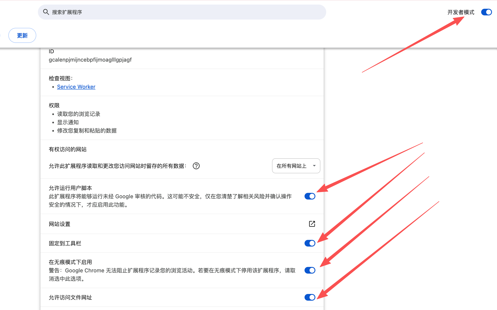

# Cookie 获取工具集

本仓库包含两种方式，用于在浏览器中**查看并复制当前页面的完整 Cookie（包括 HttpOnly）**。两者都会在页面左上角显示一个 🍪 按钮，点击即可查看/复制该域名下的全部 Cookie。

| 方式 | 目录 | 说明 |
|------|------|------|
| Chrome 扩展 | `cookie-helper/` | 独立扩展，通过 `chrome.cookies` API 获取完整 Cookie |
| 油猴脚本 | `tampermonkey-beta/` | 需配合 **篡改猴测试版** 使用，通过 `GM.cookie` 获取完整 Cookie |

---

## 一、Cookie Helper（Chrome 扩展）

### 原理

Chrome 扩展的**后台脚本（Service Worker）**可以调用受限的 `chrome.cookies` API。该 API **不受 HttpOnly 限制**，能读取当前域名下的所有 Cookie。  
前端（Content Script）在页面上显示按钮，点击后向后台发消息，后台用 `chrome.cookies.getAll({ url })` 取回完整 Cookie，再传回前端并支持一键复制到剪贴板。

### 安装步骤

1. **获取扩展文件**  
   确保本机已有 `cookie-helper` 目录（包含 `manifest.json`、`background.js`、`content.js`）。

2. **在 Chrome 中加载未打包的扩展**  
   - 打开 Chrome，地址栏输入：`chrome://extensions/`  
   - 打开右上角 **「开发者模式」**  
   - 点击 **「加载已解压的扩展程序」**  
   - 选择 **`cookie-helper`** 所在文件夹（即包含 `manifest.json` 的目录）  
   - 确认列表中出现 **「Cookie Helper」** 且已启用

3. **（可选）固定到工具栏**  
   在扩展列表中点击 Cookie Helper 的图钉图标，方便后续使用。

### 使用方法

1. 打开任意网页（如需要抓 Cookie 的站点）。
2. 页面**左上角**会出现一个 **🍪** 按钮。
3. 点击 **🍪**：
   - 弹出面板，展示当前站点**全部 Cookie**（含 HttpOnly、Secure、SameSite 等标注）。
   - 点击面板内 **「复制全部」**，可将 Cookie 以 `name=value; name2=value2; ...` 格式复制到剪贴板。
4. 再次点击 **🍪** 或面板上的 **「关闭」** 可关闭面板。

### 权限说明

- **cookies**：用于在后台读取完整 Cookie。  
- **scripting**、**host_permissions: &lt;all_urls&gt;**：用于在所有网页注入内容脚本并获取对应 URL 的 Cookie。

---

## 二、网页完整 Cookie 查看与复制（油猴脚本，需篡改猴测试版）

### 为何必须用「篡改猴测试版」

脚本使用 **`GM.cookie`**（即 `GM.cookie.list()`）来读取完整 Cookie（含 HttpOnly）。  
该 API **仅在 Tampermonkey 的测试版** 中提供，**稳定版 Tampermonkey 不支持**，因此无法在稳定版里拿到 HttpOnly Cookie。

- ❌ **不要用**：篡改猴稳定版  
  - [Chrome 应用商店 - 篡改猴（稳定版）](https://chromewebstore.google.com/detail/tampermonkey/dhdgffkkebhmkfjojejmpbldmpobfkfo?hl=zh-CN)
- ✅ **请使用**：篡改猴测试版  
  - [Chrome 应用商店 - 篡改猴测试版](https://chromewebstore.google.com/detail/%E7%AF%A1%E6%94%B9%E7%8C%B4%E6%B5%8B%E8%AF%95%E7%89%88/gcalenpjmijncebpfijmoaglllgpjagf?hl=zh-CN)

若使用稳定版，脚本会退化为仅读取 `document.cookie`，**无法获取 HttpOnly Cookie**。

### 安装步骤

1. **开启 Chrome 开发者模式**  
   - 打开 Chrome，地址栏输入：`chrome://extensions/`  
   - 打开页面右上角的 **「开发者模式」** 开关（开启后为蓝色）。

2. **安装篡改猴测试版**  
   - 打开上面的「篡改猴测试版」商店链接，点击 **「添加至 Chrome」** 完成安装。  
   - 确认浏览器中安装的是 **Tampermonkey Beta**（测试版），而不是稳定版。

3. **配置篡改猴测试版（管理扩展程序）**  
   - 在 `chrome://extensions/` 列表中找到 **「篡改猴测试版」**，点击其下的 **「管理扩展程序」**（或「详细信息」）进入该扩展的详情页。  
   - 在详情页中按下面参考图开启以下设置，否则脚本可能无法正常运行或无法通过 `GM.cookie` 获取完整 Cookie：  
     - **允许运行用户脚本**：必须开启（否则油猴无法执行用户脚本）  
     - **固定到工具栏**：建议开启，便于快速打开管理面板  
     - **在无痕模式下启用**：若需在无痕模式下使用脚本，请开启  
     - **允许访问文件网址**：若需在本地 `file://` 页面使用，请开启  

   

4. **安装用户脚本**  
   - 用 Tampermonkey 测试版 **「添加新脚本」**，或打开 **「管理面板」→「+」** 新建脚本。  
   - 将本仓库中 **`tampermonkey-beta/cookie-viewer.user.js`** 的**全部内容**复制进编辑器，保存。  
   - 或：若脚本已托管在可访问的 URL，可在 Tampermonkey 中选择 **「从 URL 安装」** 并填入该 URL。

5. **确认脚本已启用**  
   在 Tampermonkey 管理面板中，确认「网页完整 Cookie 查看与复制」脚本为**已启用**状态。  
   脚本匹配 `*://*/*`，会对所有页面生效。

### 使用方法

1. 打开任意网页。
2. 页面**左上角**会出现 **🍪** 按钮。
3. 点击 **🍪**：
   - 若运行在**篡改猴测试版**下且 `GM.cookie` 可用，会显示 **「GM.cookie（含 HttpOnly）」**，并列出完整 Cookie。
   - 若 `GM.cookie` 不可用（例如误用稳定版），会显示 **「document.cookie（仅非 HttpOnly）」**，此时只能看到非 HttpOnly 的 Cookie。
4. 点击 **「复制全部」** 可复制为 `name=value; ...` 格式；**「关闭」** 关闭面板。

### 脚本元数据说明

- **@grant GM.cookie**：用于读取完整 Cookie（测试版专属）。  
- **@grant GM_setClipboard**：用于写入剪贴板（若不可用会回退到 `navigator.clipboard`）。  
- **@match *://*/\***：所有 HTTP/HTTPS 页面。  
- **@run-at document-idle**：在 DOM 就绪后注入，避免影响页面加载。

---

## 对比小结

| 项目 | Cookie Helper（扩展） | 油猴脚本（tampermonkey-beta） |
|------|----------------------|--------------------------------|
| 依赖 | 仅需 Chrome | 必须安装 **篡改猴测试版** |
| 获取方式 | `chrome.cookies.getAll()` | `GM.cookie.list()` |
| HttpOnly | ✅ 支持 | ✅ 支持（仅测试版） |
| 安装方式 | 加载已解压的扩展程序 | 在 Tampermonkey 中新建/从 URL 安装脚本 |
| 适用场景 | 不想装油猴、只用 Chrome 扩展 | 已使用 Tampermonkey、希望用脚本统一管理 |

两种方式**不要同时启用**在同一页面，否则会出现两个 🍪 按钮；择一使用即可。
